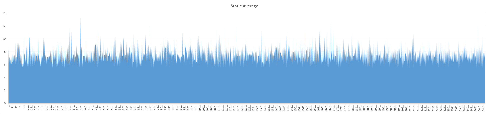

<h1>Research Question</h1>
What difference can be found between the usage of a floor marked static when compared to a floor that isn't marked as static in a scenario with a large number of rigid bodies with simultaneous collisions.

<h1>Hypothesis</h1>
Due to the large number of collisions the impact will be relatively limited.

<h1>Methodology</h1>
The test will consist of individual measurements of 2500 frames in which 10000 in a 100 x 100 square grid are continuously bouncing with a bounciness value of 0.5.
The variables measured will be the frame time in milliseconds (Time.DeltaTime * 1000) and whether the floor is marked as static. 

Potential external effects that can influence the measurements include
 - The operating system scheduler
 - Background processes
 - System thermals and the resulting boost or throttling

In order to minimize these effects of these uncontrollable variables 5 runs of each version will be done.

<h1>Results</h1>
The raw data gathered can be found in the Data.xlsx sheet.

<h1>Analysis</h1>
Due to the rather unstable and outlying values found in the first ten frames are not considered for further analysis.

Per category an average time per frame is calculated from the individual averages of every run within the category.

Number of spikes per run (average * 1.25 or greater)

The software used for these calculations can be found [here](https://github.com/KronosTheTitan/AdvancedToolsAnalysis).

The results from these calculations indicated the following values

Static results:
 - Average Number of peaks: 740,8
 - Average Frames between peaks: 2,3585313174946005
- Average Milliseconds per frame: 7,370921610959978

Non Static results:
- Average Number of peaks: 713,8
- Average Frames between peaks: 2,4880919024936956
- Average Milliseconds per frame: 7,3167329101599705

<h1>Conclusion</h1>
based on the data gathered it is currently not possible to say there is a great difference between the two, though it would be worth investigating potential differences with different workloads.
