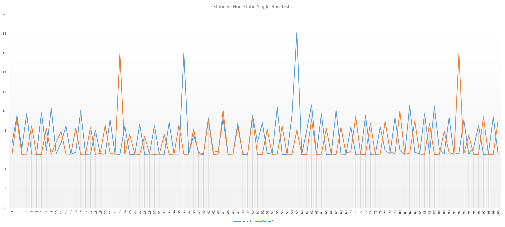
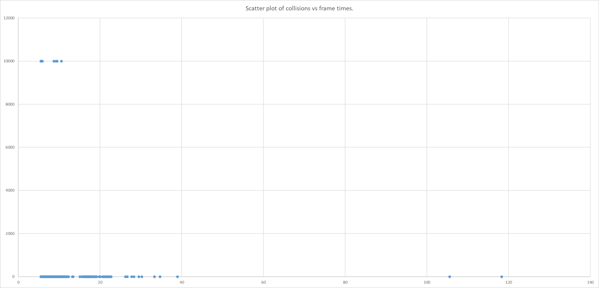

<h1>Introduction</h1>
When looking into something to research for this class I decided to make a quick prototype to see if there was anything worth investigating.

<h1>Research Question</h1>
What difference can be found between the usage of a floor marked static when compared to a floor that isn't marked as static in a scenario with a large number of rigid bodies with simultaneous collisions.

<h1>Hypothesis</h1>
Due to the large number of collisions the impact will be relatively limited with the initial prototype that sparked this being nothing more than background task interference.

<h1>Methodology</h1>
The test will consist of individual measurements of 2500 frames in which 10000 in a 100 x 100 square grid are continuously bouncing with a bounciness value of 0.5.
The variables measured will be the frame time in milliseconds (Time.DeltaTime * 1000) and whether the floor is marked as static. 

Potential external effects that can influence the measurements include
 - The operating system scheduler
 - Background processes
 - System thermals and the resulting boost or throttling

In order to minimize these effects of these uncontrollable variables 5 runs of each version will be done.

<h1>Results</h1>
The raw data gathered can be found in the Data.xlsx sheet found at the root of the repository.

<h1>Analysis</h1>
Due to the rather unstable and outlying values found in the first ten frames are not considered for further analysis.

Per category an average time per frame is calculated from the individual averages of every run within the category.

Number of spikes per run (average * 1.5 or greater)

The software used for these calculations can be found [here](https://github.com/KronosTheTitan/AdvancedToolsAnalysis).

The results from these calculations indicated the following values

Static results:
 - Average Number of peaks: 72,4
 - Average Frames between peaks: 33,01657458563536
 - Average Milliseconds per frame: 7,370921610959978
Non-Static results:
 - Average Number of peaks: 95,2
 - Average Frames between peaks: 24,68487394957983
 - Average Milliseconds per frame: 7,3167329101599705

The chart seen below is a small section of the data set created, specifically frames 10 to 109 of runs static 5 and non-static 1. This snapshot is not entirely representative of the chart as a whole, a chart that would have actually contained all the data would have been nearly unreadable. As a demonstration of that fact another chart has been included under Charts/static.png that depicts the average times per frame. It is so large that gaining useful information from it is nearly impossible. 

<h1>Conclusion</h1>
based on the data gathered it is currently reasonable to say there is a difference between the two option even at this significant workload. The static version on average had fewer peaks and had more time between the peaks, though not much of a difference in average frame times.

An additional question I now want to research is whether these peaks actually correlate with the frames in which more collisions occured.

<h1>Hypothesis</h1>
Based on the current variable distance between peaks between the runs there is little to no correlation to the consistent number of collisions per frame between the runs.

<h1>Methodology</h1>
The code used to provide the data for the first test will be extended with an additional variable in the form of counting the collisions that occured during that frame, this can be graphed against the frame times of their frames to determine a correlation between the two. An additional run of each version will be done to gather the needed data.
<h1>Results</h1>
They can be found in the sheet second test that is a part of the data.xlsx file previously mentioned.

<h1>Analysis</h1>
With the use of Excel I calculated the correlation coefficients for both versions.

These resulted in a coefficient of -0.01737198 for the non-static run and -0.016728424 for the static run, this basically means that there is next to no correlation between frame times and collisions per frame.

This can be very clearly seen in the graph below.

x-axis = milliseconds per frame
y-axis = collisions per frame

<h1>Conclusion</h1>
The hypothesis was accurate, there is next to no correlation between the collisions and frame times.

<h1>Hour Registration</h1>
Writing prototype for test 1 - 4 hours
Writing analysis tool for test 1 - 16 hours
Analyzing the data and verifying that I didn't make math errors in my code (I did do that a couple of times it turns out) - 16 hours
Making the charts (getting the charts to readable wasn't easy) - 4 hours
Second test prototype - 1 hour
Second test analysis - 5 hours